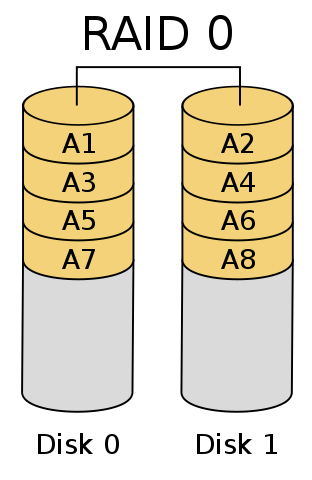
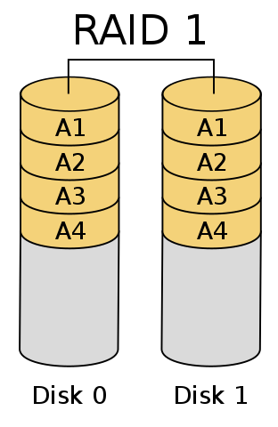
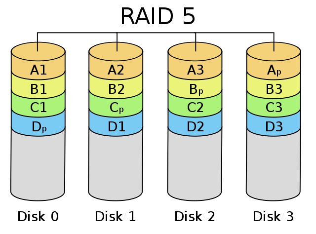
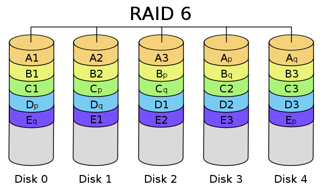

# Managing Storage

## LVM

* Logical Volume Management
* Pooling multiple storage devices as a single logical volume.
* lvm2 tools : create and manage virtual block devices from physical devices.

## RAID

* Redundant Array of Independent (or Inexpensive) Disks
* Distributing data over multiple disks for redundancy / speed / increased capacity
* Raid Controller : software or hardware

### RAID modes

usable capacity < actual capacity (when not striping)

| RAID Mode    | Min Drives    | Description    | Comments    |
|:--------------: | :-------------: | :-------------- | :-------------- |
| RAID 0    | 1    | Striping | Speed up |
| RAID 1    | 2   | Mirroring | Read is n times faster, n-1 drive failures tolerated |
| RAID 5   |  3 | Block-level striping with distributed parity   |  1 drive failure tolerated, Read is n times faster, write is n-1 times faster |
| RAID 6   | 4 | Block-level striping with dual distributed parity | 2 drive failures t lerated, read is n times faster, write is n-2 times faster |

RAID 0

RAID 1

RAID 5

RAID 6

* Imgage source : Wikipedia
